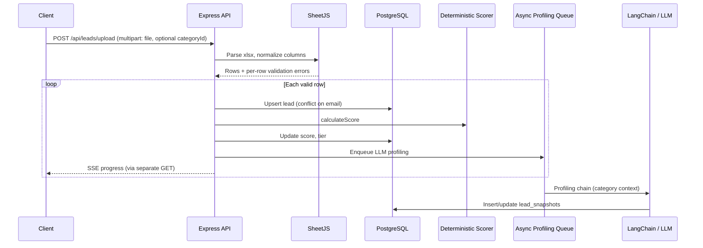
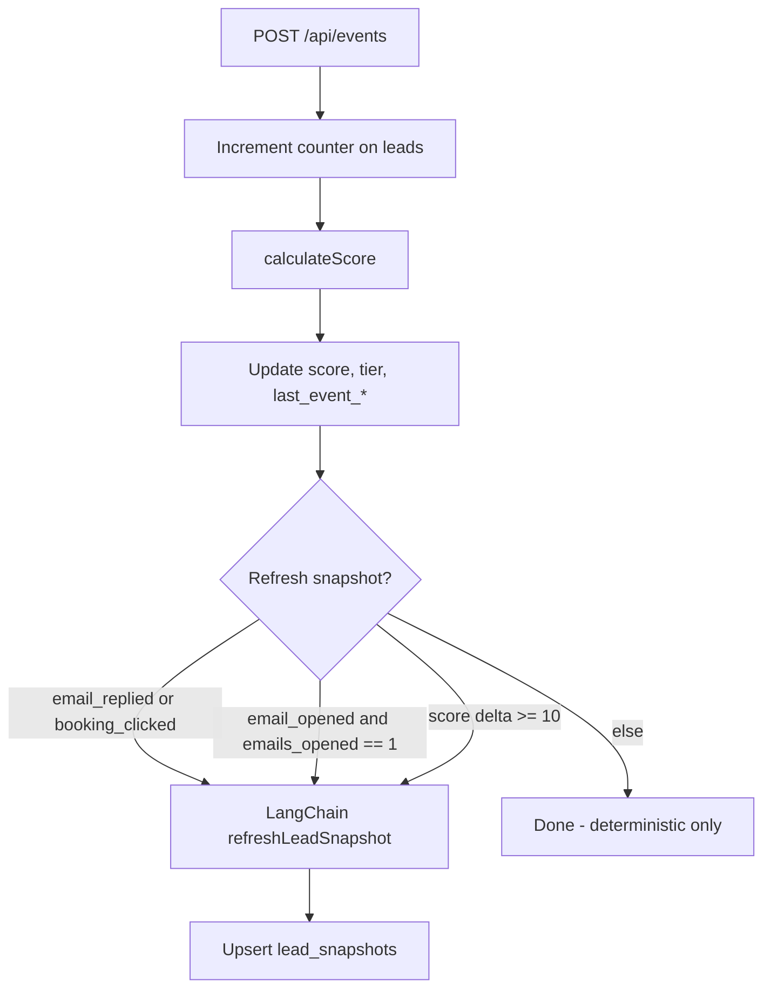

# Lead Qualifier — Backend Flow Understanding

> **Purpose of this document:** My interpretation of `lead_qualifier_spec.docx` (v1.0), focused on what the Node.js/Express backend must do. Edit inline notes, correct assumptions, and add constraints — this file will guide architecture and implementation of `razor-backend`.

---

## 1. System intent (my read)

The Lead Qualifier ingests sales leads (primarily via Excel upload), maintains a **deterministic score (0–100)** and **tier** (`hot` | `warm` | `cold`), and layers an **LLM-generated snapshot** (summary, intent, last meaningful event) only when it adds value.

**Core design principle:** *Deterministic-first, LLM-sparing.*

| Concern | Approach |
|--------|----------|
| Scoring | Pure application logic — rules + weights, no LLM |
| Profiling / synthesis | LangChain.js → OpenAI (or Claude), structured JSON |
| When LLM runs | ~1× at upload (initial snapshot) + ~0–2× over lifecycle on meaningful change |
| Persistence | PostgreSQL: `categories`, `leads`, `lead_snapshots` (+ implied upload/job tracking for SSE) |
| Ingestion | SheetJS on server for `.xlsx` parse + column mapping |

**Your edits / clarifications:**

<!-- Add corrections, priorities, or non-goals here -->

---

## 2. Domain model (backend-owned)

### 2.1 Categories

User-defined qualifiers that **ground LLM prompts** (not used in deterministic scoring).

| Field | Role |
|-------|------|
| `name` | Short label (e.g. "Enterprise SaaS") |
| `offering` | What the business sells — injected verbatim into system prompt |
| `statement` | What a good-fit lead looks like — used for fit assessment |

**API (Phase 1):** `GET /api/categories`, `POST /api/categories`

### 2.2 Leads

One row per person; **`email` is unique** (dedup / upsert on upload).

**Required on upload:** `first_name`, `last_name`, `email`  
**Optional:** `company`, `job_title`, `phone`, `source`, `initial_message`, `category_id`

**Maintained by backend:**

- Deterministic: `score`, `tier`
- Engagement counters: `emails_sent`, `emails_opened`, `links_clicked`, `replies_received`, `booking_clicks`
- Lifecycle: `last_event_at`, `last_event_type`, timestamps

If `category_id` is omitted on a row, spec says **auto-assign via LLM matching** (details TBD in implementation).

### 2.3 Lead snapshots

Separate table, **1:1 with lead** (`lead_id` unique). Qualitative layer:

| Field | Meaning |
|-------|---------|
| `summary` | Plain-language profile |
| `current_intent` | `high` \| `medium` \| `low` |
| `last_meaningful_event` | e.g. `opened`, `replied`, `clicked`, `booked` |
| `suggested_email_subject` | LLM-drafted outreach subject (set on profiling) |
| `suggested_email_body` | LLM-drafted plain-text email body |
| `suggested_email_sent_at` | When suggested email was sent via Resend |
| `current_score` | Copy of score at generation time |
| Audit: `llm_model`, `token_cost` | Cost / traceability |

**Your edits / clarifications:**

<!-- e.g. Do we need an events table for timeline? Multi-category per lead? -->

---

## 3. Deterministic scoring engine

Runs **on every upload row** and **on every event** — never calls the LLM.

### 3.1 Signals (sum, cap at 100)

| Signal | Points | Condition |
|--------|--------|-----------|
| C-level / VP / Director in title | +20 | Keyword match on `job_title` |
| Manager / Lead / Head of | +10 | Keyword match |
| Has company | +5 | Non-empty |
| Has initial_message | +10 | Non-empty |
| Source = referral | +5 | Exact match |
| Opened ≥1 email | +10 | `emails_opened >= 1` |
| Opened ≥3 emails | +5 | Additional (stacks with above) |
| Clicked link | +10 | `links_clicked >= 1` |
| Replied | +20 | `replies_received >= 1` |
| Booking click | +15 | `booking_clicks >= 1` |

Max raw sum = 110; **cap at 100** (headroom for future signals).

### 3.2 Tiers

| Tier | Score |
|------|-------|
| `hot` | 70–100 |
| `warm` | 40–69 |
| `cold` | 0–39 |

### 3.3 Backend responsibility

Pure function: load lead (or row + counters) → `calculateScore()` → persist `score`, `tier`.

**Your edits / clarifications:**

<!-- Custom keyword lists? Configurable weights? -->

---

## 4. Upload flow (backend pipeline)



### 4.1 Request / response

- **`POST /api/leads/upload`**
  - `multipart/form-data`: `file` (.xlsx), optional `categoryId` (apply to all rows)
  - Validate MIME → xlsx
  - **202 Accepted:** `{ uploadId, rowCount, status: "processing" }`

- **`GET /api/uploads/:uploadId/progress`**
  - **SSE** stream: row parsed → scored → profiled (and errors for skipped rows)

### 4.2 Processing steps (ordered)

1. Receive file; reject if not xlsx.
2. Parse with SheetJS; **normalize column names** (case-insensitive, trim).
3. Validate required columns globally; **per-row errors** without aborting whole batch.
4. **Upsert** each valid row (`ON CONFLICT email`).
5. **Deterministic score** immediately per lead (no LLM).
6. **Enqueue** each new/updated lead for async LLM profiling (initial snapshot).
7. Emit SSE progress as rows complete.

### 4.3 Open implementation questions

| Topic | Spec says | Needs your input |
|-------|-----------|------------------|
| `uploadId` storage | Implied for SSE | Dedicated `uploads` table vs in-memory job store? |
| Auto `category_id` | LLM matching if omitted | Separate chain step before profiling? |
| Row-level `category_id` in Excel | Optional per row | Override upload-level `categoryId`? |

**Your edits / clarifications:**

---

## 5. LLM / snapshot layer (LangChain)

### 5.1 When snapshot is created or refreshed

| Trigger | LLM? |
|---------|------|
| Lead created via upload | **Yes** — async after DB insert |
| Event: `email_replied` | **Always** refresh |
| Event: `booking_clicked` | **Always** refresh |
| Event: `email_opened` | **Only** if transition 0 → 1 opens |
| Event: `link_clicked` | **Only** if \|score delta\| ≥ 10 after recalc |
| Other events / minor opens | **No** — deterministic only |
| `PATCH /api/leads/:id/snapshot` | **Yes** — manual admin refresh |

**Cost target (from spec):** ~2–3 LLM calls per active lead lifetime; ~1 at upload for idle leads.

### 5.2 Profiling chain behavior

- **System prompt:** B2B qualification assistant + `category.offering` + `category.statement`
- **User prompt:** Lead profile + engagement counters + current deterministic score/tier
- **On event refresh:** Same structure + optional `metadata` (e.g. reply snippet, email subject)
- **Output:** Structured JSON — `{ summary, currentIntent, lastMeaningfulEvent, suggestedEmail: { subject, body } }`
- Persist to `lead_snapshots` including suggested email fields, `current_score`, model id, token count
- **Email delivery:** [Resend](https://resend.com) SDK — `POST /api/leads/:id/email/send` sends snapshot copy to the lead

### 5.3 Backend modules (conceptual)

| Module | Responsibility |
|--------|----------------|
| `scoring/` | `calculateScore(lead)` — pure, testable |
| `ingestion/` | Multer (or similar), SheetJS parse, column map, validation |
| `agents/profilingChain` | LangChain chain, structured output parser |
| `workers/` or job queue | Process profiling jobs post-upload; snapshot refresh jobs post-event |
| `events/` | `processEvent()` orchestration |

**Your edits / clarifications:**

<!-- Preferred LLM provider, model name, queue tech (BullMQ, in-process, etc.) -->

---

## 6. Event processing flow



### 6.1 Payload

```json
{
  "leadId": "uuid",
  "eventType": "email_replied",
  "occurredAt": "2025-05-17T10:00:00Z",
  "metadata": {
    "emailSubject": "Re: Quick question",
    "replySnippet": "Yes, we are evaluating..."
  }
}
```

**Supported `eventType` → field updates:**

| eventType | Counter | Snapshot refresh rule |
|-----------|---------|------------------------|
| `email_opened` | `emails_opened += 1` | First open only (0→1) |
| `email_replied` | `replies_received += 1` | Always |
| `link_clicked` | `links_clicked += 1` | If \|newScore - prevScore\| ≥ 10 |
| `booking_clicked` | `booking_clicks += 1` | Always |

### 6.2 Processing pseudocode (from spec)

```
1. incrementEventCounter(leadId, eventType)
2. calculateScore(lead) → compare to prevScore
3. updateLeadScore(id, score, tier, eventType, occurredAt)
4. if highValueEvent OR firstOpen OR scoreDelta >= 10:
     refreshLeadSnapshot(leadId, metadata)
```

**Note:** Outreach is sent via **Resend** using copy from `lead_snapshots.suggested_email_*`. Engagement events (`email_opened`, etc.) can still be posted manually or via webhooks.

**Your edits / clarifications:**

<!-- Webhook auth? Idempotency? events audit table for timeline UI? -->

---

## 7. API surface (backend MVP)

| Method | Endpoint | Backend behavior |
|--------|----------|------------------|
| `POST` | `/api/leads/upload` | Parse xlsx, upsert, score, enqueue profiling, return `uploadId` |
| `GET` | `/api/uploads/:id/progress` | SSE: upload + profiling progress |
| `GET` | `/api/leads` | List with score, tier, snapshot summary; query `?tier=hot&sort=score` |
| `GET` | `/api/leads/:id` | Full lead + snapshot |
| `POST` | `/api/events` | Event pipeline (§6) |
| `GET` | `/api/categories` | List categories |
| `POST` | `/api/categories` | Create category |
| `PATCH` | `/api/leads/:id/snapshot` | Force LLM snapshot refresh (includes suggested email) |
| `POST` | `/api/leads/:id/email/send` | Send suggested email via Resend; increment `emails_sent` |

**Out of scope Phase 1:** Auth, multi-tenancy, CRM, export/reporting.

**Your edits / clarifications:**

<!-- Additional filters, pagination, CORS origins, API versioning -->

---

## 8. Suggested backend architecture (draft — for your review)

This is **proposed structure** for `razor-backend`, not yet implemented:

```
src/
  index.ts                 # Express app, middleware, route mount
  config/                  # env: DATABASE_URL, OPENAI_API_KEY, etc.
  db/
    client.ts              # pg pool
    migrations/            # SQL from spec
  routes/
    categories.ts
    leads.ts
    uploads.ts
    events.ts
  services/
    leadService.ts         # CRUD, upsert
    scoringService.ts      # calculateScore
    uploadService.ts       # orchestrate parse → persist → queue
    eventService.ts        # processEvent
    snapshotService.ts     # refreshLeadSnapshot, enqueue
  ingestion/
    excelParser.ts         # SheetJS + column map
    validators.ts
  agents/
    profilingChain.ts      # LangChain + structured output
  jobs/
    profilingWorker.ts     # consume queue after upload/events
  streams/
    uploadProgress.ts      # SSE helpers
```

**Cross-cutting concerns to decide with you:**

- **Queue:** In-process vs Redis/BullMQ for profiling jobs
- **Upload jobs:** DB table `uploads(id, status, row_count, processed_count, errors jsonb)`
- **Event history:** Spec UI shows timeline — may need `lead_events` table even if not in schema snippet
- **Error handling:** Per-row errors in upload response vs SSE-only

**Your edits / clarifications:**

<!-- Preferred folder layout, ORM (raw SQL vs Prisma/Drizzle), hosting -->

---

## 9. Dependencies to add (vs current `razor-backend`)

Current stack: Express 5, CORS, dotenv, TypeScript only.

| Package / service | Purpose |
|-------------------|---------|
| `pg` or ORM | PostgreSQL |
| `multer` | Multipart upload |
| `xlsx` (SheetJS) | Excel parse |
| `langchain` + provider SDK | Profiling chain |
| `resend` | Send suggested outreach emails |
| `zod` (or similar) | Validate LLM JSON + API bodies |
| Job queue (optional) | Async profiling |
| `uuid` | IDs if not DB-generated |

**Your edits / clarifications:**

---

## 10. Phase 1 backend checklist (from spec, ordered)

1. [ ] Postgres schema: `categories`, `leads`, `lead_snapshots` (+ uploads/events if agreed)
2. [ ] `POST /api/categories`
3. [ ] `POST /api/leads/upload` — parse, upsert, deterministic scoring
4. [ ] `GET /api/uploads/:id/progress` — SSE
5. [ ] LangChain profiling chain — category context, structured JSON
6. [ ] Async queue — profiling per lead after upload
7. [ ] `POST /api/events` — counters, rescore, conditional snapshot
8. [ ] `GET /api/leads`, `GET /api/leads/:id`
9. [ ] `PATCH /api/leads/:id/snapshot` — manual refresh

**Your edits / clarifications:**

<!-- Reorder, cut scope, or add items -->

---

## 11. Assumptions I am making (please correct)

1. **Single tenant** — no org/user isolation in Phase 1.
2. **Webhook `/api/events` is unauthenticated** in demo; you'll specify auth later.
3. **Auto category assignment** when `category_id` missing is an LLM step — exact prompt/flow not fully specified.
4. **Event timeline in UI** may require a new `lead_events` table — not in the SQL snippets but implied by frontend spec.
5. **`emails_sent`** exists on lead but is not incremented in the event table in §6 — may be set elsewhere or stubbed.
6. **Express** remains the API layer; LangChain runs in the same Node process (worker module), not a separate service.

---

## 12. Questions for you (fill in below)

1. Database hosting and connection approach?
2. Queue preference: in-process, BullMQ, or something else?
3. LLM provider and model (GPT-4o-mini per cost note, or other)?
4. Should we persist **upload sessions** and **event audit log** in Phase 1?
5. Any changes to scoring weights or tier thresholds?
6. How should **category auto-assignment** work when Excel has no `category_id`?

**Your answers:**

<!-- Write here -->

---

*Generated from: `lead_qualifier_spec.docx` v1.0 — React / Node.js / LangChain.js / PostgreSQL / SheetJS*
