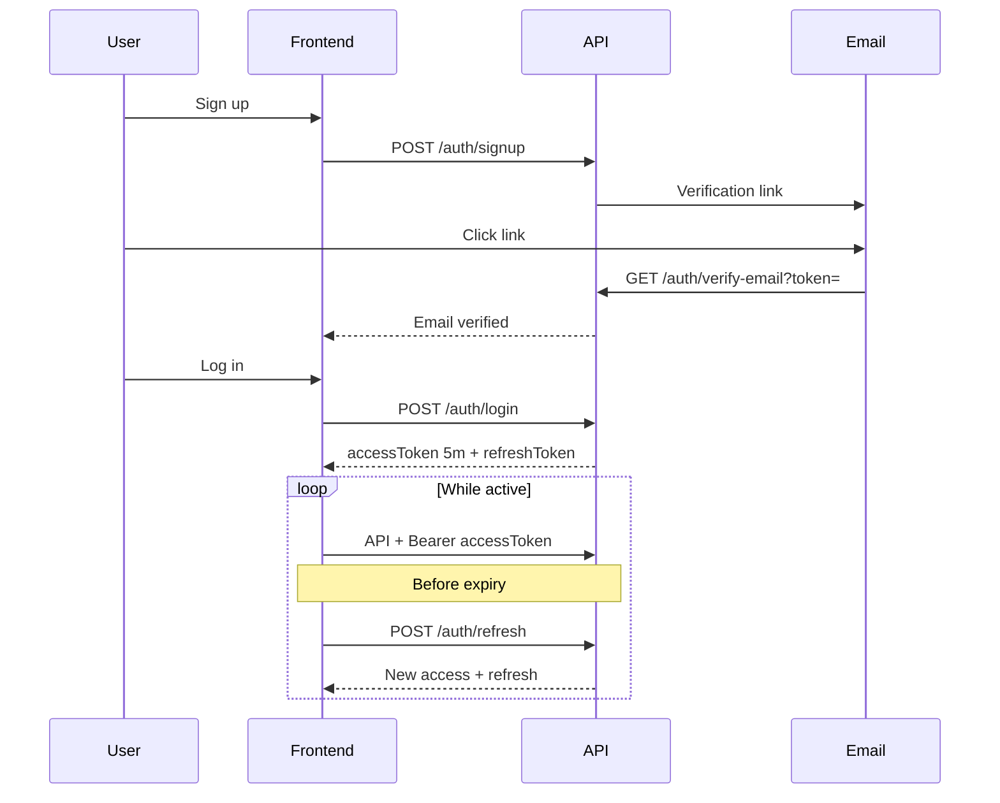

# Auth system — what we understood & what we built

## Your requirements (our interpretation)

### 1. Email + password authentication

Each **account** is a real user identified by **email** and **password** (stored hashed, never plain text). They must **sign up** before using lead/category features.

### 2. Multi-tenant data (user owns their data)

Everything a user creates or uploads is **scoped to their account**:

| Resource | Ownership |
|----------|-----------|
| **Categories** | Each category belongs to one user (their offering/statement for LLM). |
| **Leads** | Each lead belongs to the user who uploaded or created it. |
| **Snapshots** | Tied to a lead; we also store `user_id` on snapshots for direct filtering and consistency. |

Users **cannot** read or change another user’s leads, categories, or snapshots.  
Lead **email** is unique **per user** (same lead email can exist for two different accounts).

### 3. Signup + email confirmation (“OTP link”)

You described an **OTP link** in email. We implement this as a **one-click verification link** (secure random token), not a 6-digit code typed in the app:

1. `POST /api/auth/signup` with email + password  
2. Account is created but **not verified** (only after the verification email sends successfully)  
3. Email is sent with a link, e.g.  
   `{APP_URL}/api/auth/verify-email?token=...`  
4. User clicks the link → email is marked verified  
5. **Login is blocked** until verified (`403` with a clear message)

**Signup retry:** If the first attempt failed to send email (e.g. missing `RESEND_*` on the server), the user row may not exist (rolled back). If email failed after an older bug left an **unverified** row in the DB, signing up again with the same email **resends** the verification link instead of returning “already exists”. Verified accounts still get “already exists”.

This matches “click link to automatically confirm email.”

### 4. Login

`POST /api/auth/login` with email + password → returns:

- **Access token** (JWT, **5 minutes**) — send on every API call: `Authorization: Bearer <token>`
- **Refresh token** (longer-lived, stored server-side) — used to get new access tokens without logging in again

### 5. Token refresh (stay logged in)

`POST /api/auth/refresh` with `refreshToken` in body:

- Validates refresh token in DB (not expired, not revoked)
- Issues a **new access token** (another 5 minutes)
- **Rotates** refresh token (old one invalidated, new one returned)

So while the user is active, the frontend refreshes before access expires and they stay signed in. If they are idle past refresh expiry, they must log in again.

### 6. Reset password

1. `POST /api/auth/forgot-password` — user enters email; we send a **reset link** (same pattern as verify)  
2. `POST /api/auth/reset-password` — `token` + `newPassword` sets a new password  

Does not reveal whether the email exists (security).

### 7. Protected API

All `/api/categories` and `/api/leads` routes require:

1. Valid access JWT  
2. Verified email  

`/api/auth/*` stays public (except `/me` which needs auth).

---

## Flow diagram

---

## Environment variables

| Variable | Purpose |
|----------|---------|
| `JWT_SECRET` | Sign access tokens |
| `JWT_ACCESS_EXPIRES` | Default `5m` |
| `JWT_REFRESH_EXPIRES_DAYS` | Default `7` |
| `APP_URL` | Backend base URL for verify/reset links |
| `FRONTEND_URL` | Optional; if set, links point to frontend routes |
| `RESEND_*` | Transactional auth emails |

---

## Frontend integration notes

- Store `accessToken` and `refreshToken` (memory + secure storage).  
- On `401`, try refresh once, then redirect to login.  
- Schedule refresh ~1 minute before access expiry (e.g. every 4 minutes).  
- After signup, show “Check your email to verify.”

See **`API_REFERENCE.md`** for request/response shapes.
