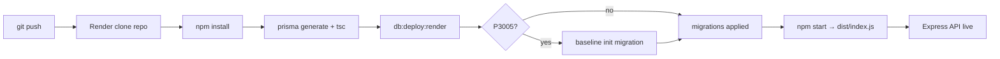

# Deployment errors postmortem (Render + Neon + Prisma)

This document records every deployment failure encountered while shipping **razor-backend** to Render with a Neon Postgres database and Prisma ORM. It explains **what broke**, **why**, and **how it was fixed** so the same mistakes are easier to avoid next time.

**Stack:** Node.js · TypeScript · Express · Prisma · Neon PostgreSQL · Render Web Service

**Working deploy configuration (summary):**

| Render setting | Value |
|----------------|--------|
| Build Command | `NPM_CONFIG_PRODUCTION=false npm install && npm run build && npm run db:deploy:render` |
| Start Command | `npm start` |
| Root Directory | *(empty — repository root)* |

See also: [`RENDER_DEPLOY.md`](../RENDER_DEPLOY.md) · [`NEON_SETUP.md`](../NEON_SETUP.md)

---

## Timeline of errors (in order encountered)

1. [Wrong start command — `src/index.js` not found](#1-wrong-start-command--srcindexjs-not-found)
2. [Prisma schema file not found on Render](#2-prisma-schema-file-not-found-on-render)
3. [Missing `DATABASE_URL_DIRECT`](#3-missing-database_url_direct)
4. [Prisma P3005 — database schema is not empty](#4-prisma-p3005--database-schema-is-not-empty)
5. [Wrong start command (again) — until `npm start` was set](#5-wrong-start-command-again)

---

## 1. Wrong start command — `src/index.js` not found

### Symptom

```
Error: Cannot find module '/opt/render/project/src/index.js'
==> Running 'node index.js'
==> Exited with status 1
```

Sometimes the path was `src/index.js`; logs also showed `Running 'node index.js'`.

### Why it happened

- The app is written in **TypeScript** under `src/index.ts`.
- Production output is compiled to **`dist/index.js`** by `npm run build` (`tsc`).
- **`dist/` is in `.gitignore`** — it is never pushed to Git; Render must **build** on every deploy.
- Render was configured (dashboard default or manual setting) to start with something like `node src/index.js` or `node index.js` **without** running the build step correctly, or **without** pointing at `dist/`.

Node cannot execute `.ts` files directly in this setup, and `src/index.js` did not exist in the repository.

### Fix

1. **Start Command** set to `npm start`, which runs `node dist/index.js` (defined in `package.json`).
2. **Build Command** must run before start: `npm run build` (which runs `prisma generate && tsc`).
3. Added **safety shims** (committed to Git):
   - Root [`index.js`](../index.js) → `require('./dist/index.js')`
   - [`src/index.js`](../src/index.js) → `require('../dist/index.js')`  
   These only work **after** a successful build; they do not replace `npm start`.
4. [`render.yaml`](../render.yaml) documents `startCommand: npm start`.

### Lesson

> **Render runs what you tell it in Start Command.** For TypeScript backends, always: **build → run `dist/`**, typically via `npm start`.

---

## 2. Prisma schema file not found on Render

### Symptom

```
Error: Could not find Prisma Schema that is required for this command.
Checked following paths:
  schema.prisma: file not found
  prisma/schema.prisma: file not found
```

During build when running `prisma generate`, `prisma migrate deploy`, or `postinstall`.

### Why it happened

The entire **`prisma/` directory was untracked in Git** (`git status` showed `prisma/` under “Untracked files”). Render clones the repository; if `prisma/schema.prisma` and `prisma/migrations/` are not committed, the build container has no schema.

Locally, Prisma worked because files existed on disk. On Render, they did not.

### Fix

1. **Committed and pushed**:
   - `prisma/schema.prisma`
   - `prisma/migrations/` (including `20250517120000_init/`)
   - `prisma/migrations/migration_lock.toml`
2. Set explicit schema location in `package.json`:
   ```json
   "prisma": { "schema": "prisma/schema.prisma" }
   ```
3. Prisma scripts use `--schema=prisma/schema.prisma` for clarity in CI/Render.

### Lesson

> **If a tool reads files from disk on the server, those files must be in Git** (unless generated during build). Prisma schema and migrations are source code, not build artifacts.

---

## 3. Missing `DATABASE_URL_DIRECT`

### Symptom

```
Error code: P1012
error: Environment variable not found: DATABASE_URL_DIRECT.
  -->  prisma/schema.prisma:8
   | directUrl = env("DATABASE_URL_DIRECT")
```

When running `prisma validate`, `prisma migrate`, or build locally with only `DATABASE_URL` in `.env`.

### Why it happened

Neon recommends two URLs:

- **Pooled** (`-pooler` in hostname) — app runtime
- **Direct** — Prisma migrations (avoids pooler limitations)

We initially modeled that in `schema.prisma` with:

```prisma
datasource db {
  url       = env("DATABASE_URL")
  directUrl = env("DATABASE_URL_DIRECT")
}
```

Prisma **requires** every `env()` reference to be set. The local `.env` only had `DATABASE_URL` (two lines total), so validation failed.

### Fix

Removed `directUrl` from `schema.prisma` so only **`DATABASE_URL`** is required:

```prisma
datasource db {
  provider = "postgresql"
  url      = env("DATABASE_URL")
}
```

Documented in [`NEON_SETUP.md`](../NEON_SETUP.md): for `prisma migrate` on Neon, temporarily use the **direct** connection string as `DATABASE_URL`, or use `npm run db:push` for prototyping.

### Lesson

> **Do not declare `directUrl` unless every environment (local, Render, CI) will set `DATABASE_URL_DIRECT`.** A single `DATABASE_URL` is simpler; swap to Neon’s direct URL only when migrations fail over the pooler.

---

## 4. Prisma P3005 — database schema is not empty

### Symptom

```
Prisma schema loaded from prisma/schema.prisma
Datasource "db": PostgreSQL database "neondb" ...
1 migration found in prisma/migrations
Error: P3005
The database schema is not empty.
==> Build failed
```

During **build** when running `prisma migrate deploy`.

### Why it happened

**Prisma Migrate** expects either:

- An **empty** database, so it can apply migrations from scratch, or  
- An existing **`_prisma_migrations`** table recording which migrations already ran.

Our Neon database **already had tables** (`categories`, `leads`, `lead_snapshots`) from:

- An earlier **raw SQL migration** (`001_schema.sql`) before Prisma was adopted, and/or  
- Manual setup / `prisma db push` in the Neon console.

So the DB had a **schema** but **no Prisma migration history**. `migrate deploy` refused to run the init migration on a “non-empty” database → **P3005**.

### Fix

**Automated (Render build):** [`scripts/deploy-migrations.mjs`](../scripts/deploy-migrations.mjs), invoked via `npm run db:deploy:render`:

1. Run `prisma migrate deploy`.
2. If output contains **P3005**, run:
   ```bash
   prisma migrate resolve --applied 20250517120000_init
   prisma migrate deploy
   ```
   This **baselines** the DB: marks the init migration as applied without re-creating tables.

**Manual (one-time, optional):**

```bash
npx prisma migrate resolve --applied 20250517120000_init --schema=prisma/schema.prisma
npx prisma migrate deploy --schema=prisma/schema.prisma
```

Build command updated to: `npm run db:deploy:render` instead of raw `prisma migrate deploy`.

### Lesson

> **Switching to Prisma Migrate on a database that already has tables requires baselining.** Either `migrate resolve --applied <migration_name>` or start from an empty Neon branch/database.

Reference: [Prisma baselining docs](https://www.prisma.io/docs/guides/migrate/developing-with-prisma-migrate/add-prisma-migrate-to-a-project#baseline-your-production-environment)

---

## 5. Wrong start command (again)

### Symptom

Same as [§1](#1-wrong-start-command--srcindexjs-not-found) after fixing Prisma/build issues:

```
==> Running 'node index.js'
Error: Cannot find module '/opt/render/project/src/index.js'
```

Build may have succeeded; **start** still used the wrong command.

### Why it happened

- **`render.yaml` is not applied automatically** unless the service was created from a Blueprint or linked to the repo’s blueprint file.
- Dashboard **Start Command** overrode `npm start` (e.g. `node src/index.js` or Render’s Node default).
- Deploy succeeded only after explicitly setting **Start Command → `npm start`** and ensuring **Build Command** ran `npm run build`.

Additional hardening:

- Moved **`typescript`** and **`prisma`** to **`dependencies`** so `tsc` and Prisma CLI are available even when Render skips devDependencies.
- Build uses `NPM_CONFIG_PRODUCTION=false npm install` so devDependencies install during the build phase if needed.

### Lesson

> **Verify Start Command in the Render dashboard** after every service change. Do not assume `render.yaml` is active unless the service uses it.

---

## Root causes (patterns)

| Pattern | What went wrong |
|---------|------------------|
| **Source vs build output** | Trying to run `src/*.ts` or missing `dist/` on the server |
| **Git ≠ local disk** | Prisma folder existed locally but was never pushed |
| **Env var contract** | Schema referenced env vars not set in Render/local `.env` |
| **Migration history vs reality** | DB had tables from pre-Prisma workflow; Migrate disagreed |
| **Dashboard vs repo config** | `render.yaml` correct but dashboard settings stale |

---

## Final working pipeline



### Files added or changed for deploy stability

| File | Role |
|------|------|
| `render.yaml` | Blueprint: build + start commands, Node 20 |
| `RENDER_DEPLOY.md` | Short Render checklist |
| `scripts/deploy-migrations.mjs` | Migrate deploy + P3005 baseline |
| `index.js` / `src/index.js` | Entry shims if start command is wrong |
| `package.json` | `build`, `start`, `db:deploy:render`, `prisma.schema` |
| `prisma/schema.prisma` | Single `DATABASE_URL` datasource |
| `prisma/migrations/*` | Versioned schema (committed) |

---

## Pre-deploy checklist (use before next release)

- [ ] `git push` includes `prisma/`, `scripts/`, `index.js`, `render.yaml`
- [ ] Render **Build Command** runs `npm run build` and `npm run db:deploy:render`
- [ ] Render **Start Command** is `npm start` (not `node src/...`)
- [ ] Render **Environment** has `DATABASE_URL` (Neon, `?sslmode=require`)
- [ ] Build logs show `tsc` success and `dist/index.js` created
- [ ] Build logs show migrations applied or baselined (no P3005 failure)
- [ ] Start logs show `Server running on port ...`

---

*Last updated: May 2025 — reflects deploy fixes through successful Render production start.*
